# 📊 Credit Scoring: ML-платформа оценки заемщиков

Добро пожаловать в проект 📈 `credit_scoring` — универсальное ML-решение для скоринговой модели, построенное на Python + LightGBM + CatBoost + SHAP + Optuna, с поддержкой DVC пайплайна и высокой интерпретируемостью.

---

# 🔄 Обновление:

- ✅ Обновлены скрипты (более оптимизированны, включают больше признаков, улучшена читаемость)
- ✅ Добавлены метки, описание и метрики для всех признаков
- ✅ Сформированы выводы по результатам моделей
- ✅ Интеграция с новым DVC-пайплайном
- ✅ SHAP + Optuna внутри каждой стадии обучения

---

# 📁 Структура проекта `credit_scoring`
# credit_scoring
```
credit_scoring/ 
├── CONTRIBUTING.md 
├── dvc.lock 
├── dvc.yaml 
├── pyproject.toml 
├── poetry.lock 
├── setup.cfg 
├── final_model.pkl 
├── README.md 
├── project_structure.txt 
├── image-1.png ... image-10.png 
│ ├── notebooks/ 
│ ├── install_and_work_postgres.ipynb 
│ ├── preprocssing_HomeWork.ipynb 
│ └── math_stat_work.ipynb 
│ ├── src/ 
│ ├── app/ 
│ │ ├── antifraud/ # (✓) Подсистемы антифрода 
│ │ │ └── .gitkeep 
│ │ ├── core/ # Основная логика моделей 
│ │ │ ├── api.py 
│ │ │ ├── calculator.py 
│ │ │ ├── model.py 
│ │ │ ├── model_create.ipynb 
│ │ │ └── catboost_model.cbm 
│ │ ├── modelling/ 
│ │ │ ├── final_model_regressor2.pkl 
│ │ │ ├── model.py 
│ │ │ ├── model_tree.py 
│ │ │ ├── .gitignore 
│ │ │ ├── .gitkeep 
│ │ │ │ │ │ │ ├── data_features/ 
│ │ │ │ ├── datast_model_core.csv 
│ │ │ │ ├── shap_importans_model_first 
│ │ │ │ └── .gitignore 
│ │ │ │ │ │ │ ├── features/ 
│ │ │ │ ├── features_application_train_test.py 
│ │ │ │ ├── features_bureau.py 
│ │ │ │ ├── features_bureau_balance.py 
│ │ │ │ ├── features_credit_card_balance.py 
│ │ │ │ ├── features_installments_payments.py 
│ │ │ │ ├── features_previous_application.py 
│ │ │ │ ├── README.md 
│ │ │ │ └── image-1.png ... image-10.png 
│ │ │ │ │ │ │ ├── metrics/ 
│ │ │ │ ├── README_METRICS.md 
│ │ │ │ ├── modeling_model.ipynb 
│ │ │ │ └── image-[1-4].png 
│ │ ├── scoring/ # Скрипты предсказания 
│ │ │ └── .gitkeep 
│ │ └── utils/ # Вспомогательные модули 
│ │ ├── db_handler.py 
│ │ ├── log_parsing.py 
│ │ └── pycache/... 
│ │ │ └── config/ 
│ ├── db_config.py 
│ └── pycache/... 
│ └── models/ 
├── final_model.pkl 
└── catboost_model.cbm
```

## Кривая roc-auc для логистической регресии
1) Для всей выборки
2) для валидационной выборки 
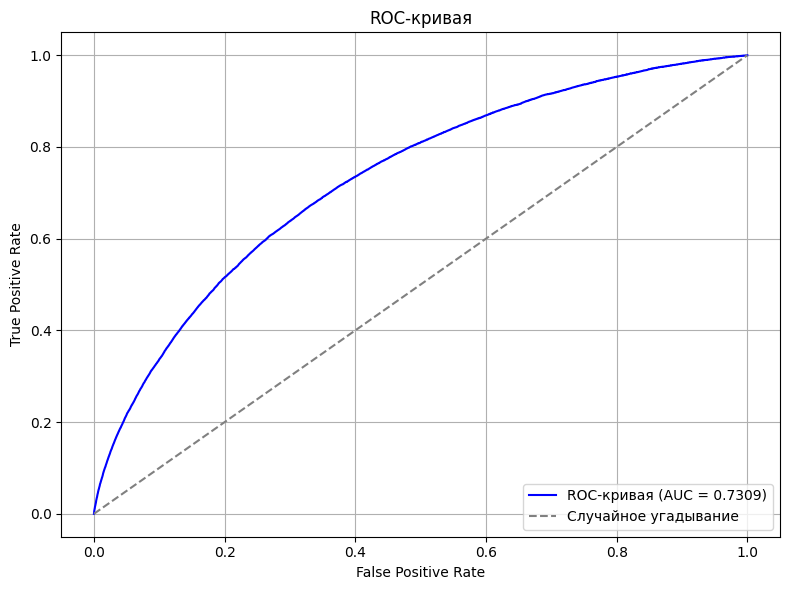
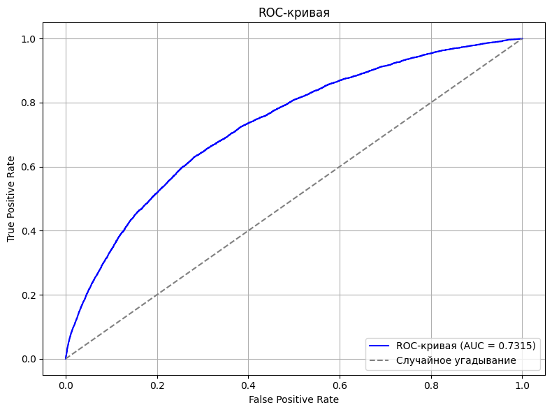

## confusion_matrix и  classification_report для логистической регресии
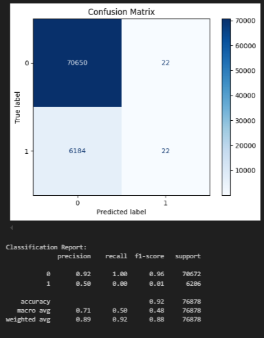


## Кривая roc-auc для деревянной модели 
1) Для всей выборки
2) для валидационной выборки 
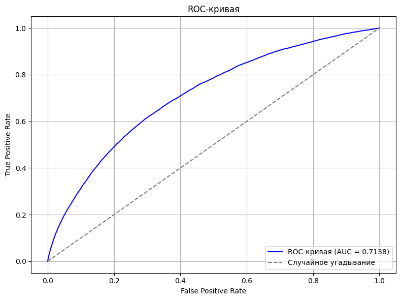
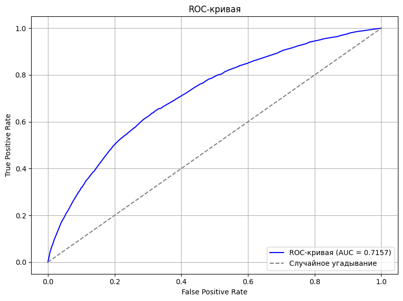

## confusion_matrix и  classification_report для деревянной модели
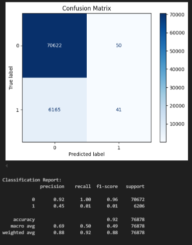

# Вывод:
## Общие показатели:

Обе модели показывают общую accuracy около 92% — однако при несбалансированности классов (70,672 объектов класса 0 против 6,206 объектов класса 1) высокая accuracy в данном случае мало информативна.

Для обеих моделей "macro avg" и "weighted avg" существенно зависят от доминирующего класса (класс 0).

## ROC-AUC:

Линейная модель (вероятно, логистическая регрессия) имеет ROC-AUC = 0.73.

Деревянная модель (Decision Tree с указанными параметрами) имеет ROC-AUC = 0.71.

Здесь линейная модель демонстрирует немного лучшее разделение классов по вероятностной шкале, даже если разница не столь велика.

## Классовые метрики для класса 1 (интересующий нас, как правило, для редкого события):

### Линейная модель:

precision ≈ 0.50, recall = 0.00 (при этом f1-score = 0.01)

### Decision Tree:

precision ≈ 0.45, recall = 0.01 (f1-score = 0.01)

Оба случая показывают, что модели практически не «находят» объекты класса 1. Причины могут быть следующими:

* Дисбаланс классов. Основной класс (0) сильно доминирует, и модели склонны выбирать его, чтобы улучшить общую accuracy.

* Порог классификации. Возможно, если скорректировать порог принятия решения (сдвинуть его в сторону повышения recall для класса 1), можно добиться лучшего баланса между precision и recall.

## Функция ошибки и выбор метрики:

Несмотря на то, что обе модели практически игнорируют класс 1 в плане recall, линейная модель показывает чуть более высокий ROC-AUC, что говорит о лучшем распределении предсказанных вероятностей. Это может свидетельствовать о том, что линейная модель обладает лучшей способностью ранжировать объекты, даже если конечное бинарное решение принимается некорректно.


### Обучение модели бустинга и случайного леса
## Кривая roc-auc для LGBMClassifier
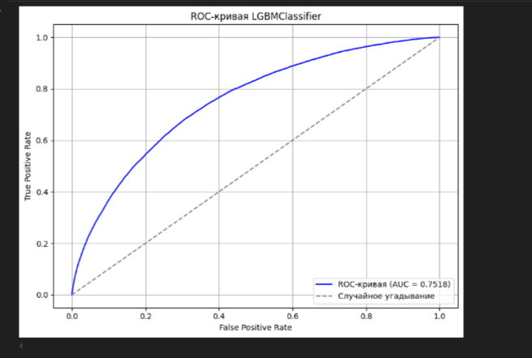

## confusion_matrix и  classification_report для LGBMClassifier
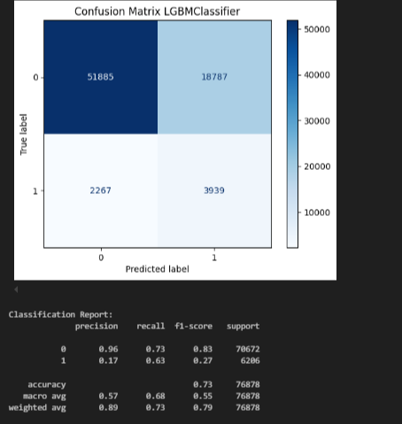


### Обучение модели бустинга и случайного леса
## Кривая roc-auc для RandomForest
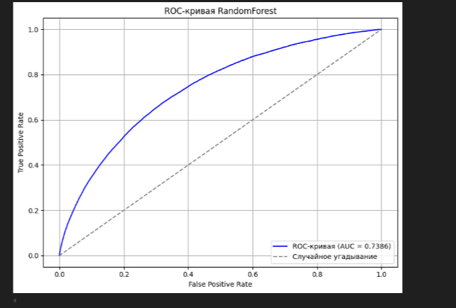

## confusion_matrix и  classification_report для RandomForest
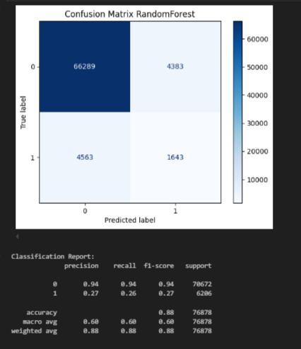


### Обучение модели СatBoost 
## Кривая roc-auc для СatBoost

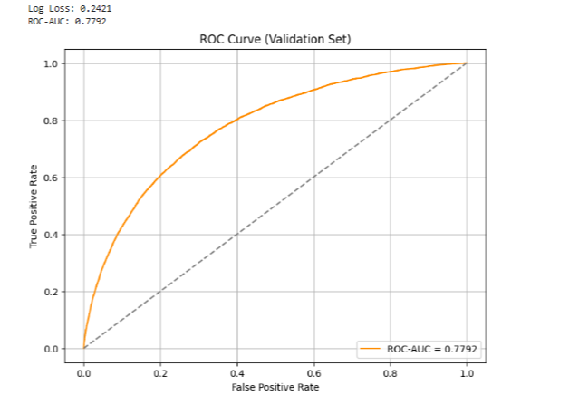

1. ✅ ROC-AUC = 0.7792


Очень хороший результат для дефолтной модели без тюнинга

0.77–0.78 ROC AUC — это на уровне хороших бейзлайнов

Эта метрика говорит, что модель хорошо разделяет дефолтных и недефолтных клиентов.

📌 При этом:

Катбуст учитывает категориальные признаки автоматически,

Он устойчив к масштабам признаков и пропускам,

Это позволяет обойтись без масштабирования и при этом получить конкурентный результат.

2. ✅ LogLoss = 0.2421

Низкий LogLoss = хорошая калибровка прогнозов.

Это показатель того, насколько вероятности "уверенны".

Значение ниже 0.3 — уже хорошо.

Значение ~0.24 — отличная калибровка из коробки!

3. 📈 ROC-кривая

ROC-кривая лежит заметно выше диагонали (что ожидаемо для хорошей модели).

Особенно крутая в диапазоне низких FPR (~0.05–0.2), что важно для задач, где FP дорого стоят (например, кредитование).

Кривая плавная, без резких изломов → стабильная модель, нет переобучения на валидации.

## confusion_matrix и  classification_report для СatBoost


### 📈 ROC-AUC:
- **LogReg** ≈ 0.73
- **Decision Tree** ≈ 0.71
- **LightGBM** > 0.77
- **CatBoost** = 0.7792 ✔
- **RandomForest** ≈ 0.74

### 🧪 Recall на классе `1`:
- У Logistic Regression и Decision Tree: **recall ≈ 0.00–0.01**
- Это значит, что модели почти не находят положительные примеры при стандартном `0.5` пороге

### 💡 Вывод:
- Порог стоит оптимизировать (например, через Precision-Recall curve)
- Катбуст даёт отличный baseline, даже без настройки
- LightGBM потенциально может быть улучшен с помощью Optuna на отфильтрованных фичах

---

# 🔄 В разработке

- 📍 Новая модель — «оценка риска по крупным лимитам»
- 📍 Детальный антифрод-модуль (`src/app/antifraud/`)
- 📍 Устойчивость к шуму во входных данных
- 📍 Автогенерация признаков для предобработки перед `predict()`
- 📍 Поддержка MLflow
