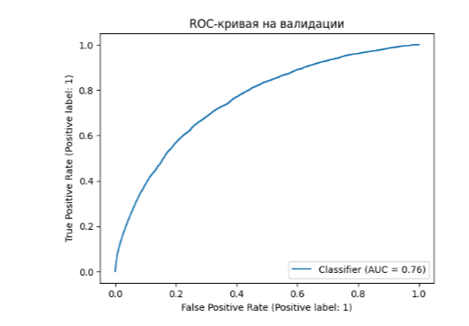
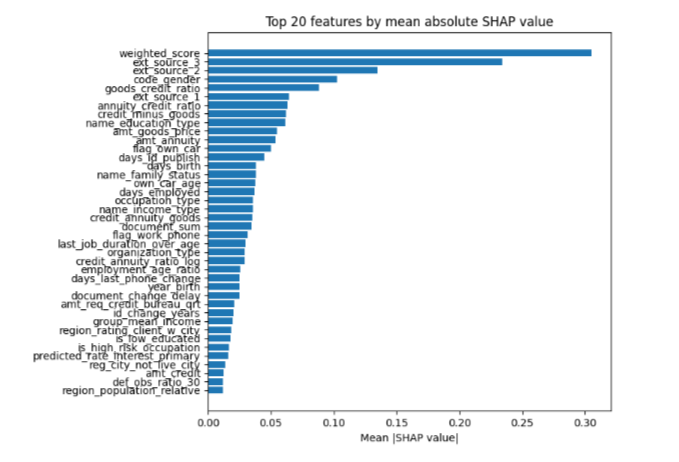
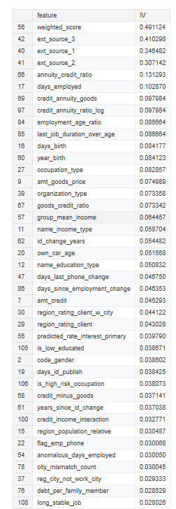
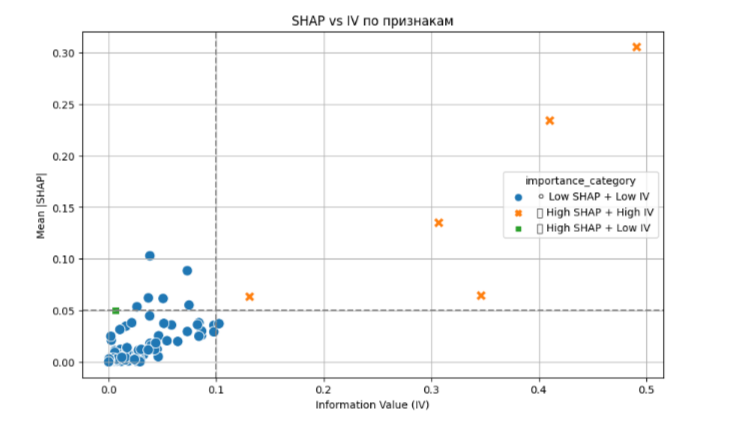
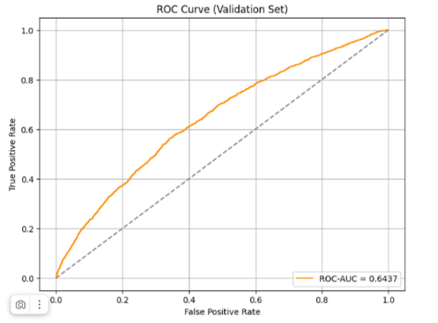
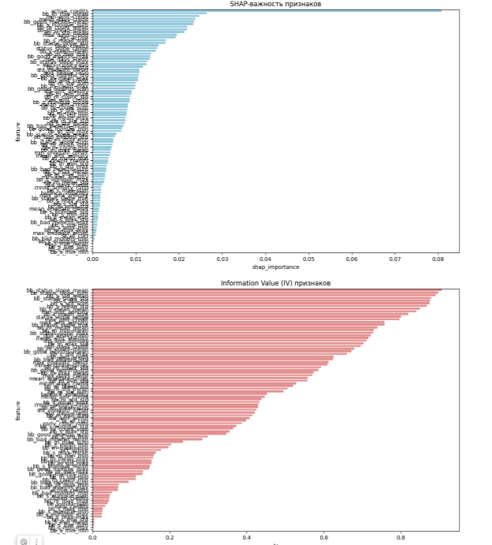
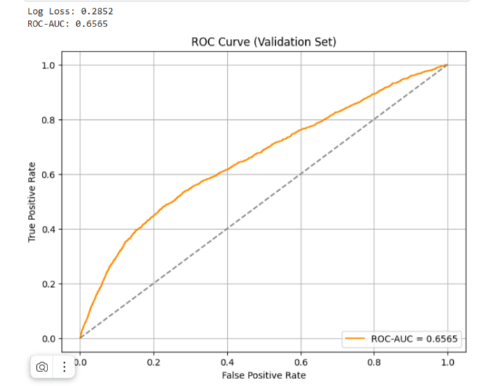
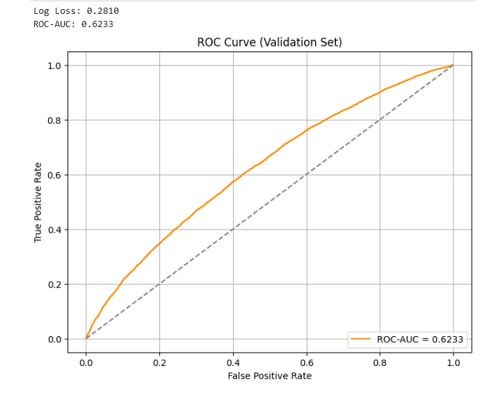
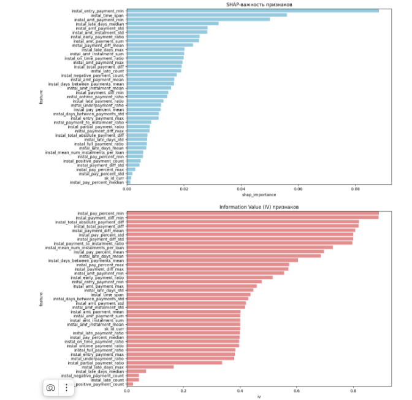

# 📊 Feature Engineering: application_train_test.csv
Home Credit Default Risk

## 🔍 Описание

Этот файл содержит описание специально сконструированных признаков (features), полученных на основе стартового датасета application_train_test.csv из соревнования Home Credit Default Risk (Kaggle).

Все признаки предназначены для улучшения качества модели за счёт логичных трансформаций и взаимодействий между базовыми переменными.

✅ В будущем сюда будут добавлены признаки на основе других таблиц: bureau, bureau_balance, previous_application, credit_card_balance и др.

## 📁 Источник данных

📦 application_train_test.csv
(объединённый application_train.csv и application_test.csv)
🛠️ Список сгенерированных признаков и их описание
Ниже сгруппированы признаки по тематическим блокам. Вы можете использовать как отдельные признаки, так и всё множество при построении модели.

1. 🧾 Документы (Document Flags)

Признак	Описание

document_sum	Общее количество предоставленных документов (сумма по FLAG_DOCUMENT_*). Чем выше — тем больше документов предоставил клиент.

doc_known_score	Суммарная оценка по наличию документов и информации по жилью (document_sum + отсутствие полного набора по жилью).

has_weak_docs	Флаг, указывающий на отсутствие достаточного количества документов и/или информации по жилью.

2. 🏠 Информация о жилье

Признак	Описание

flag_full_info_house	Флаг 1/0 — имеет/не имеет минимум 30 заполненных признаков по объекту недвижимости. Отражает полноту информации о жилье.

3. 🆔 Идентификационные данные

Признак	Описание

year_birth	Год рождения клиента (расчитано по DAYS_BIRTH).

years_since_id_change	Сколько лет назад был заменён идентификационный документ.

id_change_years	Возраст клиента на момент смены документа.

document_change_delay	Флаг — документ заменён не в типичном возрасте (14, 20, 45 лет). Может быть индикатором рисковой группы.

4. 💰 Финансовые соотношения

Признак	Описание

income_annuity_ratio	Отношение годовой аннуитетной нагрузки к доходу.

credit_vs_income_ratio	Долговая нагрузка: кредит к доходу.

annuity_credit_ratio	Аннуитет к телу кредита.

goods_credit_ratio	Стоимость товаров к размеру кредита.

credit_minus_goods	Разница между суммой кредита и стоимостью товара.

credit_annuity_goods	Аннуитет как доля в сумме кредита + стоимости товара.

disposable_income	Располагаемый доход после ежемесячного платежа.

monthly_payment_pct	Сколько % ежемесячного дохода уходит в платёж.

monthly_disposable	Дифференцированный располагаемый доход в месяц.

5. 👨‍👩‍👧 Семья и дети

Признак	Описание

avg_count_children_per_adult	Среднее число детей на одного взрослого.

avg_income_per_child	Средний доход на ребёнка.

avg_income_per_adult	Средний доход на взрослого члена семьи.

debt_per_family_member	Объём кредита на одного члена семьи (в т.ч. детей).

6. 🌍 География и стабильность адреса

Признак	Описание

region_mismatch_count	Суммарное количество несовпадений регионов проживания и регистрации.

city_mismatch_count	Суммарное количество несовпадений городов.

is_fully_stable	Проживание, регистрация и работа — в одном регионе и городе.

fully_mismatched	Клиент живёт, зарегистрирован, работает — в разных регионах.

pop_rating_product	Интерактив: плотность населения * рейтинг региона

region_mismatch_total	Общее число всех региональных и городских несовпадений.

7. 👷 Работа и стаж

Признак	Описание

employment_age_ratio	Доля стажа к возрасту.

last_job_duration_over_age	Продолжительность текущей работы по сравнению с возрастом.

days_since_employment_change	Сколько дней прошло между сменой работы и публикацией ID.

days_since_reg	Сколько дней прошло между регистрацией и заменой ID.

recent_activity_indicator	Индикатор активности по телефону ↔ идентификация.

8. 👥 Социальное окружение

Признак	Описание

def_obs_ratio_30, def_obs_ratio_60	Доля дефолтных знакомых среди наблюдаемых в течение 30/60 дней.

has_defaulters_around	Флаг: есть ли дефолтные лица в соц. окружении.

total_social_obs	Общее число наблюдаемых за 30 и 60 дней.

total_social_def	Суммарное количество дефолтных знакомых.

9. 🧬 Бинарные признаки и категории риска

Признак	Описание

is_single_parent	Родитель-одиночка.

is_big_credit_low_income	Высокий кредит при низком доходе.

young_age, old_age	Возрастные категории: младше 1990, старше 1960.

children_presence	Есть ли дети.

owns_realty_and_car	Владеет и недвижимостью, и автомобилем.

owns_neither	Не владеет ни недвижимостью, ни автомобилем.

is_employed_and_educated	Работающий и с высшим образованием.

is_low_educated	Низкий уровень образования.

is_high_risk_occupation	Работа в "рискованных" сферах (охранник, водитель, разнорабочий).

long_stable_job	Очень долгий стаж (более 10 лет).

short_employment_gap	Краткосрочный стаж (до 3 лет).

10. ☎️ Контактные данные и доступность

Признак	Описание

has_mobile_and_email	Есть мобильный и email.

num_active_phones	Общее число активных телефонов.

contactability_score	Счёт, насколько клиент легко доступен для связи.

11. 🏦 Кредитная активность в бюро

Признак	Описание

request_intensity	Количество запросов в кредитное бюро по всем периодам.

recent_bureau_activity	Была ли активность в бюро в последние дни или неделю.

12. 📊 Производные и логарифмические признаки
Признак	Описание
income_per_fam_member	Доход на каждого члена семьи.

credit_annuity_ratio_log	Логарифм отношения аннуитета.

annuity_income_ratio_log	Логарифм аннуитета к доходу.

credit_income_ratio_log	Логарифм кредита к доходу.

credit_income_interaction	Взаимодействие суммы кредита и дохода — как признак.

is_semi_stable	Частично стабильный клиент (неполная стабильность региона).

## Анализ признаков

При обучении дефолтного CatBoost классификатора и предсказания на валидационной выборке были получены результаты:

### LogLoss: 0.24601, CVaR@60%: 2.63602

LogLoss (логарифмическая потеря): 0.24601

LogLoss — это метрика, которая оценивает, насколько хорошо модель предсказывает вероятности классов. Чем ниже значение LogLoss, тем точнее модель предсказывает вероятности.

0.24601 — это довольно низкое значение, что говорит о том, что модель предсказывает вероятности достаточно точно и уверенно.

В бинарной классификации LogLoss обычно лежит в диапазоне от 0 (идеальное предсказание) до бесконечности (очень плохие предсказания). Обычно значения меньше 0.5 считаются хорошими, а ниже 0.3 — отличными.

Таким образом, значение 0.24601 говорит о том, что модель хорошо предсказывает вероятности классов.

CVaR@60% (Conditional Value at Risk на 60% уровне): 2.63602

CVaR (Conditional Value at Risk) — это мера риска, которая оценивает среднее значение потерь, превышающих заданный уровень риска (в данном случае 60%).

2.63602 — это значение говорит о том, что среднее значение потерь в худших 40% случаев (по потерям) составляет 2.63602.

Интерпретация: Чем ниже значение CVaR, тем лучше модель справляется с управлением рисками, т.е. модель реже даёт большие ошибки и лучше контролирует потери в худших случаях.
### ROC-AUC:

Довольно хороший результат для модели из коробки

### SHAP - важность:

Можем видить, что определено ядро  модели в виде признаков, на которые она будет опираться больше всего

### IV признаков:

Интересные показатели но давайте посмотрим на диаграмму рассеивания SHAP vs IV

И тут напрашивается вывод о том, что картина меняется, признаки распределяются не по порядку их значисоти, многие признаки с высоким IV не вошли в топ по SHAP и наоборот многие признаки с низким IV используются в модели как очень важные, вероятно это происходит в определённих бинах в связке с другими признаками

# 🧮 Признаки на основе bureau и bureau_balance
## 📦 Источник данных
🗃 Таблицы:

bureau и bureau_balance

📍 Источник: Postgres с помощью PostgresDBHandler

📌 Целевая таблица: application_train_test (в будущем данные будут объединяться с sk_id_curr)

## 📊 Назначение
Здесь описываются признаки, сгенерированные на основе данных кредитной истории клиентов из внешнего бюро (bureau, bureau_balance). Цель — получить информацию о поведении клиента по прошлым и текущим займам, включая:

уровень и динамику просрочек

активность кредитов

статистику по кредитным суммам и срокам

показатели стабильности и долговой нагрузки

Признаки можно использовать для повышения качества моделей скоринга / оценки рисков.

## 🧱 Список признаков и их описание

1. 📌 Признаки на уровне клиента (sk_id_curr)

Название	Описание

total_credits	Общее количество кредитов клиента (по bureau).

active_credits	Количество "активных" кредитов.

closed_credits	Количество "закрытых" кредитов.

min_days_credit	Минимum дней с момента подачи кредита (самый старый).

max_days_credit	Credit был подан недавно (ближе к 0 días).

mean_days_credit	Среднее значение по days_credit.

std_days_credit	Стандартное отклонение days_credit.

min_enddate_offset	Срок, в который кредит погашен быстрее всех.

max_enddate_offset	Срок самого длинного кредита.

mean_enddate_offset	Средний срок по окончанию кредитов.

std_enddate_offset	Разброс окончания кредитов.

min_amt_credit	Самый маленький кредит (итоговая сумма).

max_amt_credit	Самый большой кредит.

mean_amt_credit	Средняя сумма кредита.

std_amt_credit	Стандартное отклонение по кредитам.

min_amt_annuity	Минимальный ежемесячный платеж.

max_amt_annuity	Максимальный ежемесячный платеж.

mean_amt_annuity	Средняя сумма аннуитета (платежей).

std_amt_annuity	Разброс/волатильность платежей.

2. 📦 Агрегированные признаки из bureau_balance (bb_)

Название	Описание

bb_m_count_*	Количество месяцев, в которых были записи по кредиту (длина истории).

bb_m_min/max/mean/std_*	Статистика по временным индексам months_balance.

bb_s_min/max/mean/std_*	Минимальные / максимальные значения уровней просрочек (status).

bb_s_nunique_*	Кол-во уникальных уровней просрочки по кредиту.

bb_good_months_*	Количество "хороших" месяцев (без просрочек).

bb_bad_months_*	Количество месяцев с просрочкой (status > 0).

bb_status_slope_*	Наклон линии тренда просрочек по времени (рост/падение риска).

3. ❗ Признаки с _*_min, _*_max, _*_mean, _*_std, _*_sum — это клиентские агрегаты по всем кредитам.

4. 🛠️ Инженерные признаки (derived features)

Название	Описание

pct_active	Доля активных кредитов от общего числа.

early_close_ratio	Насколько быстро кредит (или кредиты) были погашены.

credit_annuity_ratio	Средняя сумма кредита относительно среднего платежа — отражает нагрузку.

dpd_heavy_ratio	Доля месяцев с просрочками от общего числа месяцев.

status_slope_range	Размах между максимальным и минимальным трендом просрочек — нестабильность.

balance_volatility	Смещение и нестабильность поведения по months_balance.

## Анализ признаков

При обучении дефолтного CatBoost классификатора и предсказания на валидационной выборке были получены результаты:

### Log Loss: 0.2779  ROC-AUC: 0.6437

LogLoss (логарифмическая потеря): 0.2779

0.2779 — это довольно низкое значение, что говорит о том, что модель предсказывает вероятности достаточно точно и уверенно, но ей нехватает тех признаков которые мы использовали ранее, однако очень хорошо, учитывая что тут больше признаков на историческое поведение клиентов

### ROC-AUC:

Видим, что модель не сильно лучше случайного угадывания, посмотрим что модель скажет о важности признаков

### SHAP - важность:

Можем видить, что есть несколько признаков которые проявляют влияние на таргет но давайте сравним с IV

### IV признаков:

Видим что важность одной системы не гарантирует важность в другой системе, возможно качество оценки улучшиться на сборном датасете

# 🧮 Признаки на основе credit_card_balance
## 📦 Источник данных
🗃 Таблица: credit_card_balance

📍 Источник: Postgres с помощью PostgresDBHandler

📌 Целевая таблица: application_train_test (в будущем данные будут объединяться с sk_id_curr)

## 📊 1. Общие агрегаты (agg_all, agg_recent_*)
Агрегаты рассчитываются по всей истории и за последние 3, 6 и 12 месяцев (по MONTHS_BALANCE).

Для каждого клиента (SK_ID_CURR) считаются следующие статистики:

1. 🔹 Признаки общего состояния:

amt_balance_mean, sum, min, max

Средний, суммарный, минимальный и максимальный баланс на кредитной карте

amt_credit_limit_actual_mean, sum, min, max

Средний и другие статистики по кредитному лимиту

amt_payment_current_mean, sum, min, max

Суммы текущих платежей

amt_drawings_current_mean, sum, min, max

Снятие денежных средств (любого типа)

2. 🕒 Те же признаки с суффиксом:

_recent_3, _recent_6, _recent_12

Это агрегаты только за последние n месяцев (например, amt_balance_mean_recent_6)

3. 🔁 Отношения между периодами:

amt_balance_mean_ratio_3, _6, _12 – отношение среднего баланса по всей истории к среднему балансу за последние 3/6/12 месяцев

amt_balance_sum_ratio_3, _6, _12

amt_credit_limit_actual_mean_ratio_*

amt_payment_current_sum_ratio_*

⚠️ Признаки с ratio_* показывают, изменяется ли поведение за последние месяцы. Например, если amt_balance_mean_ratio_6 > 1, значит текущий баланс уменьшился относительно общего.

4. 📈 Трендовые признаки (линейная регрессия по времени)

Расчёт линейного тренда (slope) по оси MONTHS_BALANCE. Чем выше значение, тем более устойчивый рост или падение параметра со временем.

balance_trend_slope — тренд по балансу

payment_min_trend — тренд по минимальному обязательному платеже (AMT_INST_MIN_REGULARITY)

utilization_trend_slope — тренд по использованию лимита (balance / credit_limit)

➕ Положительный тренд говорит об увеличении показателя, отрицательный — об уменьшении.

5. 📊 Поведение и DPD

Аггрегация различных поведенческих метрик:

mean_utilization — средняя утилизация кредитного лимита

late_payment_ratio — доля месяцев с просрочкой (по SK_DPD > 0)

max_sk_dpd, mean_sk_dpd — максимальная и средняя просрочка

6. 💳 Активность:

total_amt_drawings — сумма всех снятий (в т.ч. POS, ATM)

total_cnt_drawings — количество всех снятий

total_cnt_installments — общее число платежей (кумулятивно)

7. 💰 Платежное поведение:

balance_mean — средний баланс

credit_limit_mean — средний кредитный лимит

payment_mean — средний платёж

8. 🧮 Отношения:

payment_balance_ratio — среднее отношение платежей к балансу

payment_to_limit_mean — платежи / лимит

payment_to_balance_mean — платежи / баланс

9. 📈 Управление кредитом:

high_util_ratio — доля месяцев, когда утилизация > 80%

has_credit_limit_ratio — доля месяцев, когда лимит > 0

10. ⚖️ Изменения баланса во времени

Работают как производные от анализа времени:

balance_delta — разница между последними и первыми значениями AMT_BALANCE

balance_pct_change — процентное изменение баланса = (last - first) / first

11. 🔚 Последние значения (как snapshot пользователя)

Взяты из последнего месяца (months_balance) по клиенту:

last_amt_balance — последний доступный баланс

last_credit_limit — последний лимит

last_utilization — последняя утилизация лимита

## Анализ метрик 

Начало кривой: хороший захват истинно позитивных объектов при низком уровне FP → это хорошо.

Но сегмент между 0.2–0.6 по FPR — плавный рост без резких подъёмов → модель не идеально ищет TP с минимальной ошибкой FP.

🟠 Это означает, что:

У модели умеренные способности различать дефолтных/недефолтных клиентов.

Признаки помогают, но несильно улучшают дискриминирующую способность модели.

# 🧮 Признаки на основе installments_payments
## 📦 Источник данных
🗃 Таблица: installments_payments

📍 Источник: Postgres с помощью PostgresDBHandler

## 📌 Целевая таблица: application_train_test (в будущем данные будут объединяться с sk_id_curr)

В этом разделе описаны признаки, извлечённые из таблицы installments_payments.csv. Они отражают платёжную дисциплину клиента, регулярность, вариативность, риски просрочек и финансовые отклонения.

Признаки агрегируются по SK_ID_CURR, и являются результатом продвинутой обработки связанной таблицы кредитов клиента, с учётом всех доступных схем платежей.

## 📊 Список извлечённых признаков

Признак	Описание

instal_amt_payment_sum	Общая сумма всех фактических платежей

instal_amt_payment_mean	Средний размер платежа

instal_amt_payment_std	Стандартное отклонение по платежам

instal_amt_payment_max	Максимальный платёж

instal_amt_payment_min	Минимальный платёж

instal_amt_instalment_sum	Всего начислено к оплате (инсталляции)

instal_amt_instalment_mean	Средняя сумма инсталляции

instal_amt_instalment_std	Стандартное отклонение по инсталляциям

instal_payment_diff_mean	Среднее отклонение между платежом и инсталляцией

instal_payment_diff_std	Разброс переплат / недоплат

instal_payment_diff_min	Минимальное отличие (максимальная недоплата)

instal_payment_diff_max	Максимальная переплата

instal_negative_payment_count	Кол-во платежей ниже суммы инсталляции

instal_positive_payment_count	Кол-во платежей выше инсталляции

instal_late_days_mean	Среднее число дней просрочки

instal_late_days_std	Стандартное отклонение по просрочкам

instal_late_days_max	Максимальная задержка по оплате

instal_late_days_median	Медианная просрочка

instal_late_count	Кол-во просроченных платежей

instal_ontime_payment_ratio	Доля платежей, совершённых вовремя

instal_pay_percent_mean	Средняя доля платежа от инсталляции (amt_payment/amt_instalment)

instal_pay_percent_std	Стандартное отклонение по оплате в процентах

instal_pay_percent_max	Максимальная доля оплаты

instal_pay_percent_min	Минимальная доля оплаты

instal_pay_percent_median	Медианная доля оплаты

instal_mean_num_instalments_per_loan	Среднее число взносов на один кредит

instal_entry_payment_min	Самый ранний зарегистрированный платёж (по дате)

instal_entry_payment_max	Самый поздний зарегистрированный платёж

instal_days_between_payments_mean	Среднее число дней между платежами

instal_days_between_payments_std	Разброс интервала между платежами

instal_late_payment_ratio	Доля просроченных платежей (late_days > 0)

instal_early_payment_ratio	Доля платёжных операций до срока

instal_on_time_payment_ratio	Поведение по своевременности (0-1)

instal_partial_payment_ratio	Частичные платежи (между 50% и 100% от инсталляции)

instal_full_payment_ratio	Полные или переплаченные платежи (≥100%)

instal_underpayment_ratio	Платежи менее 100% от текущей инсталляции

instal_payment_to_instalment_ratio	Общее соотношение платежей к начисленным суммам

instal_total_payment_diff	Совокупный оверпей / андерпей клиентом

instal_total_absolute_payment_diff	Абсолютное значение совокупного отклонения

instal_time_span	Продолжительность платежного поведения (последний – первый платёж)

## ✅ Применение признаков

Эти признаки используются для обучения моделей категории SK_ID_CURR и помогают:

выявить нарушителей кредитной дисциплины;

отличить "надёжных платёжников" от "хронических отстающих";

оценить степень нестабильности в поведении клиента;

дополнить кредитный скоринг пространством признаков из платежной активности.

## Анализ метрик на новых признаках 

В предыдущих примерах (например, с credit_card_balance) AUC был ~0.61–0.65.

Здесь на одних лишь installments_payments данных — ~0.623 — это значимый вклад.

Кривая ROC действительно выше случайной (диагонали), хотя и довольно близко к ней.

Это говорит о том, что новые признаки:

дают некоторую дискриминирующую способность,

но, вероятно, лучше работают в сочетании с другими фичами (бюро, кредиты, заявки).

Что сработало:
✅ Много признаков временны́х и относительных (diff, ratio, percent, std) оказались полезными
✅ SHAP и IV показывают взаимно подтверждающее влияние
✅ Инженерия "классических" признаков оправдала ожидания

# 🧮 Признаки на основе previous_application
## 📦 Источник данных
🗃 Таблица: previous_application

📍 Источник: Postgres с помощью PostgresDBHandler

## 📌 Целевая таблица: application_train_test (в будущем данные будут объединяться с sk_id_curr)
Эти признаки помогают модели понять:

поведение клиента при предыдущих попытках получить кредит,

соотношения между суммами,

частоту одобрений/отказов,

цели и типы заявок.

## 📋 Список признаков

Признак	Описание

prev_app_count	Количество предыдущих заявок клиента

prev_app_approved_ratio	Доля заявок с одобрением (Approved)

prev_app_refused_ratio	Доля заявок с отказом (Refused)

prev_app_cash_loan_unknown_share	Доля заявок с неизвестной целью кредита (name_cash_loan_purpose == XNA)

prev_app_cash_share	Доля заявок с типом "Consumer loans" (кредиты наличными)

1. 💰 Кредитные суммы

Признак	Описание

prev_amt_credit_sum	Сумма всех выданных кредитов по заявкам

prev_amt_credit_mean	Средний размер выданного кредита

prev_amt_credit_max	Максимальный выданный кредит

prev_amt_credit_std	Стандартное отклонение размера кредита

prev_amt_application_mean	Средняя сумма, которую клиент запрашивал

prev_credit_to_app_ratio_mean	Среднее отношение выданного кредита к запрашиваемому

prev_amt_app_minus_credit_mean	Среднее отличие заявки от фактически выданных средств

2. 🛒 Товар / цели кредита

Признак	Описание

prev_amt_goods_price_mean	Средняя цена товара/цели кредита

prev_goods_to_credit_ratio_mean	Среднее отношение amt_goods_price / amt_credit

prev_amt_app_minus_goods_mean	Разница между желаемым получением (application) и ценой товара

3. 📉 Первоначальный взнос

Признак	Описание

prev_down_payment_rate_mean	Среднее значение RATE_DOWN_PAYMENT

prev_downpayment_to_app_mean	Доля первоначального взноса от запрашиваемой суммы

4. 🕒 Временные признаки

Признак	Описание

prev_days_decision_min	Самая старая заявка (по дате подачи)

prev_days_decision_max	Последняя заявка

prev_days_decision_mean	Среднее значение DAYS_DECISION

prev_days_decision_std	Стандартное отклонение DAYS_DECISION

prev_application_time_span	Временной размах между первой и последней заявкой

5. ⏳ Сроки кредита

Признак	Описание

prev_planned_duration_mean	Средний планируемый срок кредита (DAYS_LAST_DUE - DAYS_DECISION)

prev_planned_duration_std	Стандартное отклонение длительности кредита

6. 🧠 Поведенческие и флаговые признаки

Признак	Описание

prev_most_common_status	Чаще всего встречающийся статус заявки (Approved, Refused, и т.д.)

prev_most_common_cash_purpose	Самая популярная цель кредитования (cash_loan_purpose)

prev_most_common_weekday	Наиболее частый день недели подачи заявки

prev_unique_contracts	Количество уникальных типов контрактов (например, Cash, Revolving)

prev_unique_purposes	Число уникальных целей кредита

7. 📌 Дополнительные фичи-отношения

Признак	Описание

prev_credit_more_than_app_count	Количество заявок, где выдали больше, чем клиент просил

prev_app_below_goods_count	Количество заявок, где запрошено меньше, чем стоил товар

prev_credit_per_application	Средний объём кредита на одну заявку

prev_rejected_and_approved_mix_flag	Было ли у клиента и одобрение, и отказ по заявкам

prev_credit_to_goods_diff	Разница между средним кредитом и средней ценой товара

## 📘 Примечания:

Все признаки агрегированы по SK_ID_CURR — по каждой строке в features один клиент.

Категориальные признаки prev_most_common_* могут использоваться только с моделями, поддерживающими категориальные фичи (например, CatBoost или LightGBM с cat_features).

При использовании со StandardScaler или XGBoost строковые столбцы нужно закодировать (LabelEncoder, OneHotEncoder или удалить).

✅ Итоговый вывод

Пункт	Оценка

📈 ROC-AUC	0.6254 — умеренно полезный результат

🧠 SHAP	Обнаружены ВАЖНЫЕ признаки с поведенческим и временным смыслом

ℹ IV	Подтвердил силу моногенных признаков из суммы, длительности и отклонений

🚀 Перспективы	Отличная база для объединения с признаками из других таблиц
