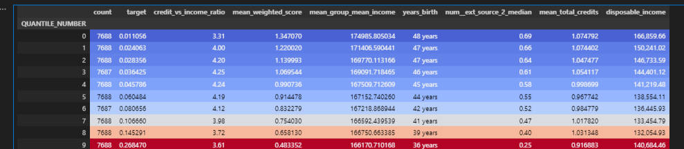
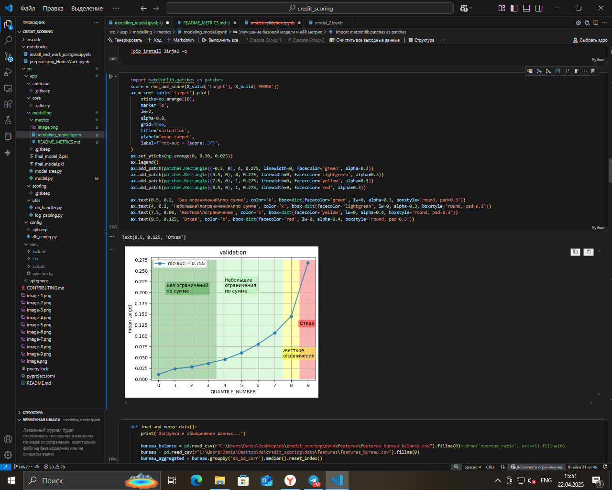
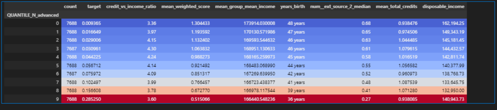
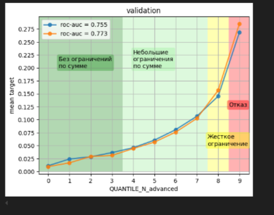
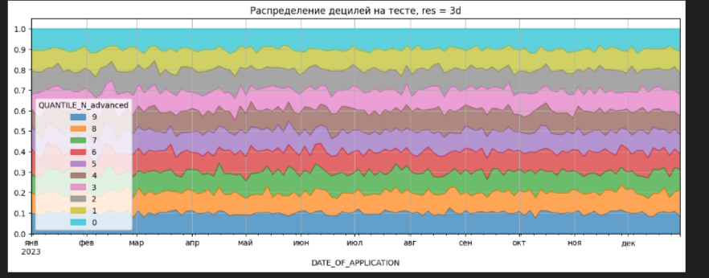

## Результаты сортировки начальной модели:

## Группировка в зависимости от вероятности полученной от модели:

## Результаты сортировки модели c обагащёнными признаками:

## Группировка в зависимости от вероятности полученной от модели c обагащёнными признаками:

## 1. Изменение средних показателей по квантилям
#### target: в «низком» квантиле он опустился (0.011→ 0.009), а в «высоком» вырос (0.268→ 0.285).

####  credit_vs_income_ratio почти не изменился, но mean_weighted_score сместился: низкие квантиля получили чуть более высокие скор‑оценки.

#### median ext_source_2 и доход по-прежнему чётко отличаются: низшие квантиля имеют более высокий ext_source_2, более высокий доход и больший возраст.

#### Вывод: модель стала ещё чуть более чувствительной к разным сегментам риска, усилив контраст «хороших» и «плохих» клиентов.

## 2. Кросс‑таблица «старых» vs «новых» квантилей

#### Диагональ (где old=new) — от 65% в квантиле 0 до 72% в квантиле 9.

#### Смещения:

#### Из старого 0‑го квантиля 24% перешло в новый 1‑й, но почти никто не поднялся сразу в высокие квантиля.

#### Из старого 9‑го квантиля 21% перешло в новый 8‑й, 5% в 7‑й, но 72% остались в 9‑м — значит, модель старая «расплывалась» сильнее.

#### Улучшение дисперсии: новые квантиля «скошены» сильнее к диагонали → меньше «размывания» между отдалёнными квантилями.

# Итоговая оценка
#### Модель стала более «резкой»:
##### – Клиенты теперь чаще остаются в том же квантиле или переходят на соседний, а не на отдалённые.

#### Улучшена сегментация риска:
##### – Верхний квантиль новых предсказаний (9) содержит более концентрированно «плохих» клиентов (target≈0.29).

##### – Нижний квантиль новых предсказаний (0) стал ещё «чище» (target≈0.009).

#### Стабильность:
##### – Диагональ кросс‑таблицы выросла (с ~60–65% до ~65–72%) — меньше «шумных» попаданий не на свои квантиля.

## Вывод: «продвинутые» вероятности (PROBA_advanced) дают лучшее ранжирование клиентов по риску — сегменты стали более чистыми и однородными.

## Распределение децилей по дате
